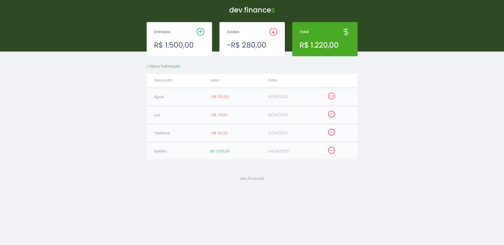

<h1 align="center">
  dev.finance$
</h1>

  

 

  
  
  
  

 

  <a href="README.md">Português</a>
  ·
  <a href="README-en.md">English</a>

<h4 align="center">
  Mini financial system 💰!
<h4>

    <a href="#-technologies">Technologies</a>&nbsp;&nbsp;&nbsp;|&nbsp;&nbsp;&nbsp;
    <a href="#-getting-started">Getting started</a>&nbsp;&nbsp;&nbsp;|&nbsp;&nbsp;&nbsp;
    <a href="#-how-to-contribute">How to contribute</a>&nbsp;&nbsp;&nbsp;|&nbsp;&nbsp;&nbsp;
    <a href="#-license">License</a>

## 🚀 Technologies

- [HTML](https://developer.mozilla.org/pt-BR/docs/Web/HTML)
- [CSS](https://developer.mozilla.org/pt-BR/docs/Web/CSS)
- [JavaScript](https://developer.mozilla.org/pt-BR/docs/Web/JavaScript)

## ⌛ Getting started

Clone the repository.

`git clone https://github.com/zehguilherme/maratona-discover.git`

Launch the application.

1. `cd maratona-discover`
2. Double click on the `index.html` file

## 🤔 How to contribute

1. Fork this repository;
2. Create a branch with your feature: `git checkout -b my-feature`;
3. Commit your changes: `git commit -m "feat: My new feature"`;
4. Push to your branch: `git push origin my-feature`;
5. Create a pull request;
6. After the merge of your pull request is done, you can delete your branch.

## 📝 License

This project is under the MIT license. See the [license](LICENSE) for more information.

---

Made with 💟 by José Guilherme Paro Monteiro Tomaine 👋 [Talk to me!](https://www.linkedin.com/in/jos%C3%A9-guilherme-paro-monteiro-tomaine/)
